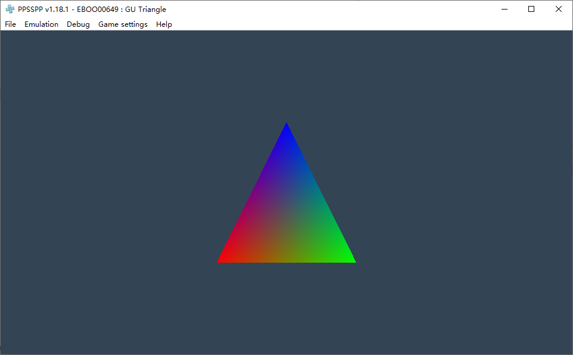

# PSP_helloworld



A basic psp app

# Config PSP toolchain

1. Download PS2 toolchain
    - https://github.com/pspdev/pspdev/releases/latest/download/pspdev-ubuntu-latest-x86_64.tar.gz
2. Config `PATH`

```bash
export PSPDEV="$HOME/pspdev"
export PATH="$PATH:$PSPDEV/bin"
```

# Referencs

- https://pspdev.github.io/
- https://github.com/pspdev/pspsdk
- https://github.com/pspdev/pspsdk/tree/master/src/samples
- https://www.ppsspp.org/
